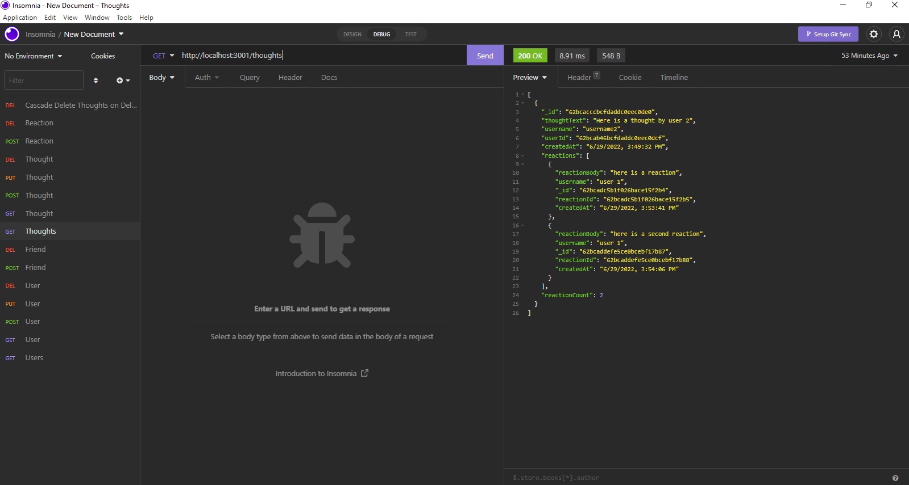

  # Social Network API (NoSQL)
   
    
  This NoSQL RESTful API uses MongoDB to host the backend for a social media site. Users are able to create an account, add and remove friends, create and delete thoughts, and react to thought posts.
  
  ## Table of Contents
  * [Bonus Features](#features)
  * [Installation](#installation)
  * [Built With](#built)
  * [Usage Information](#usage)
  * [Authors & Acknowledgements](#credits)
  * [License](#license)
  * [Contact](#questions)
  
  ## Bonus Features
  This application also features a "cascade on delete" feature that removes a user's associated thoughts upon user deletion.
    
  ## Installation
  This application is backend only. After cloning the repository, enter "npm i" in the terminal to install all required dependencies. "npm start" will start the server and sync the MongoDB database.
  
  ## Built With
  * JavaScript
  * Node.js
  * Express.js
  * MongoDB
  * Mongoose
  * Nodemon
  * Insomnia

  ## Usage Information
  This application is a RESTful API that enables CRUD operations for a social media/blog site. 
  Video walkthrough of how to use this application, [here](https://drive.google.com/drive/folders/1KErZCGVzBECJN8gtv0OsnxiMC_8F1vnD?usp=sharing). 
    
    
  ## Authors & Acknowledgements
  Harsha's match regex [here](https://stackoverflow.com/questions/58898066/mongoose-unique-email-address-validation). 
  Akash's max validator [here](https://stackoverflow.com/questions/45031701/how-to-set-minimum-value-great-then-0-in-mongoose-schema).

  Made by [TOVTC](https://github.com/TOVTC). 
  Originally submitted 2022Jun29.
  
  ## License
  This application uses the MIT License. For more information regarding usage, please visit [this link](https://opensource.org/licenses/MIT).

  ## Questions?
  Contact repository author via [GitHub](https://github.com/TOVTC). 
    
  ## Assignment Information - NoSQL Challenge: Social Network API
  ### User Story
  AS A social media startup 
  I WANT an API for my social network that uses a NoSQL database 
  SO THAT my website can handle large amounts of unstructured data
  
  ### Acceptance Criteria
  GIVEN a social network API 
  WHEN I enter the command to invoke the application 
  THEN my server is started and the Mongoose models are synced to the MongoDB database 
  WHEN I open API GET routes in Insomnia for users and thoughts 
  THEN the data for each of these routes is displayed in a formatted JSON 
  WHEN I test API POST, PUT, and DELETE routes in Insomnia 
  THEN I am able to successfully create, update, and delete users and thoughts in my database 
  WHEN I test API POST and DELETE routes in Insomnia 
  THEN I am able to successfully create and delete reactions to thoughts and add and remove friends to a user’s friend list
    